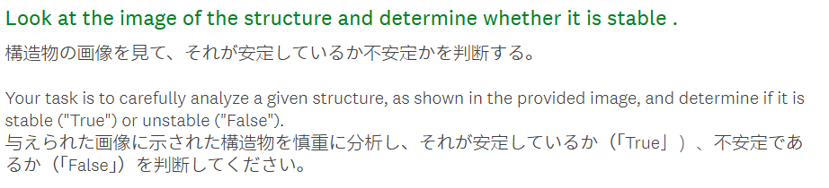
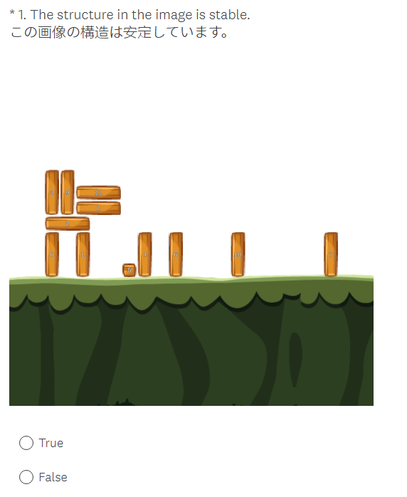
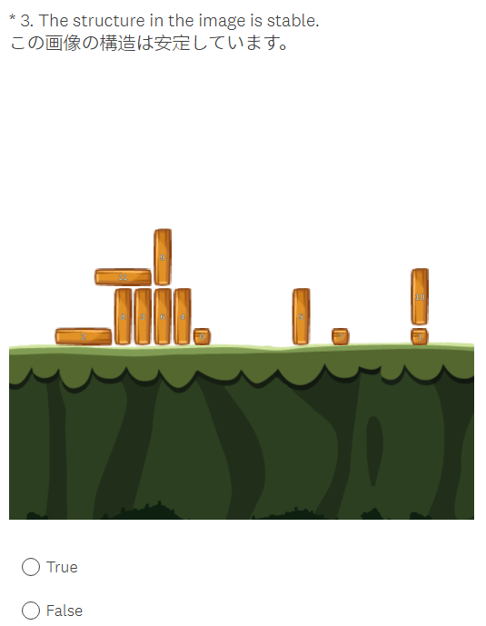
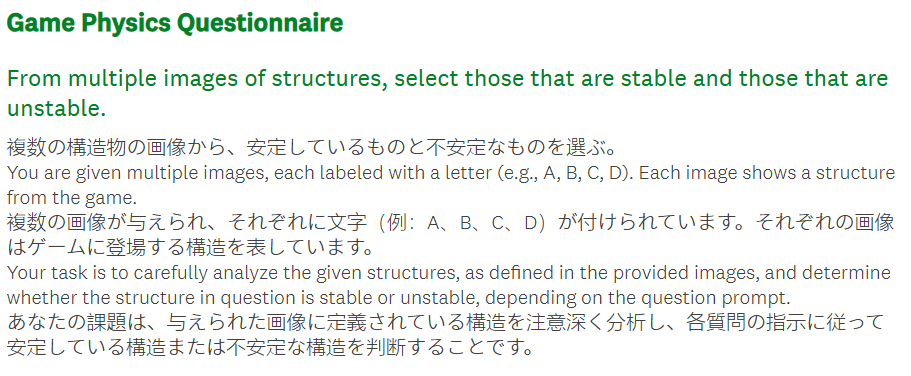
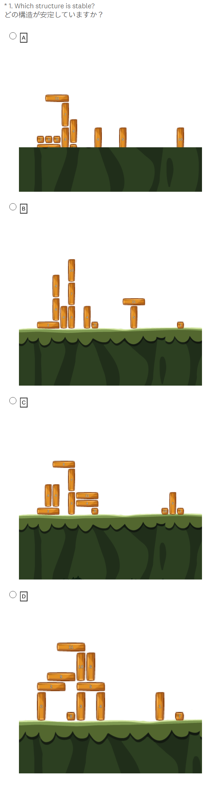
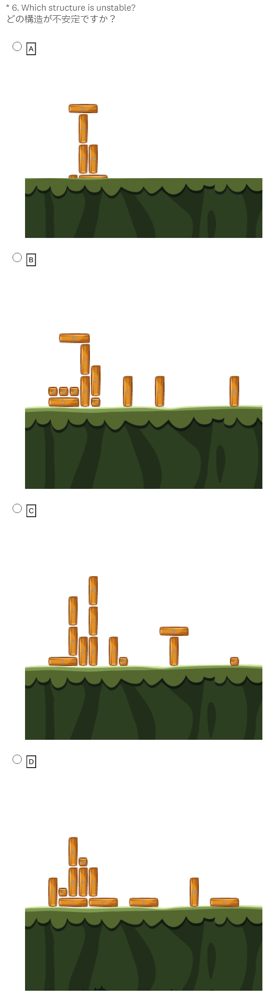
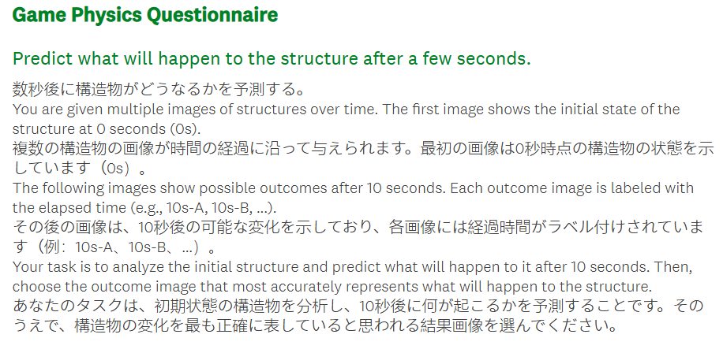
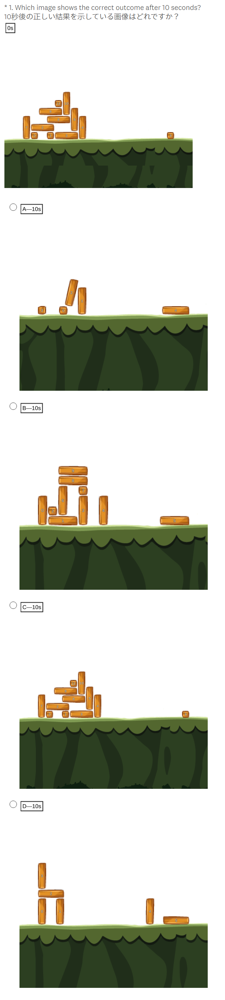
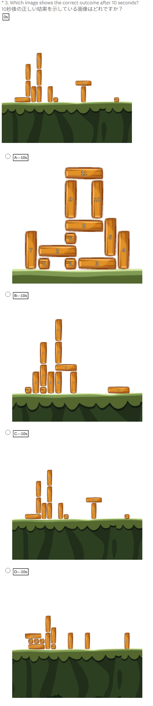
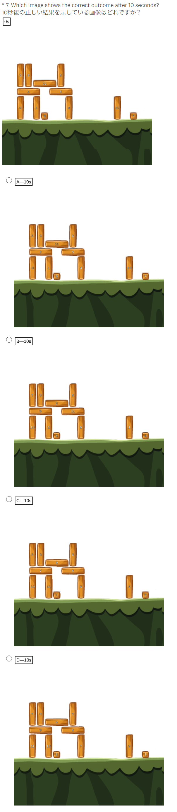

# Example

## Task 1

### Task 1 - Instruction

### Task 1 - Stable

### Task 1 - Unstable

## Task 2

### Task 2 - Instruction

### Task 2 - Stable

### Task 2 - Unstable

## Task 3

### Task 3 - Instruction

### Task 3 - 'Diff_Block'

### Task 3 - 'Diff_Level'

### Task 3 - 'Diff_id'

